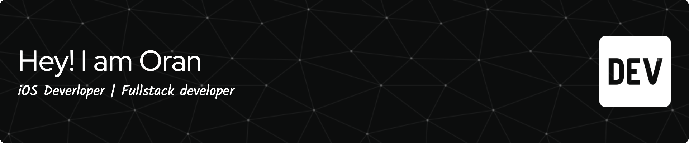

## 🚀 About Me
Hello! I'm Oran Levi, an iOS Developer. I enjoy building meaningful applications and experimenting with new technologies.

Feel free to browse my GitHub repositories to see some of my recent projects. Note that while I showcase some projects here, others are available on the App Store.

If you have any questions or would like to collaborate, please don't hesitate to contact me through [LinkedIn profile](http://linkedin.com/in/oranlevi). 

I look forward to hearing from you!

## 📱 iOS Projects
Here are some of my recent iOS projects:

[**MovieMagic**](https://github.com/OranLevi/MovieMagic): An iOS app utilizing SwiftUI, Combine, and MVVM architecture, empowering users to explore and access movie information through the MovieDB API.

[**Coinblock**](https://github.com/OranLevi/coinblock): Track and monitor cryptocurrency prices, portfolios, and market trends with ease. Stay updated, view detailed coin information, and effortlessly manage your investments in one convenient mobile app.

More project are available on the [App Store](https://apps.apple.com/il/developer/oran-levi/id1653309601).
## 💬 Get in Touch
If you have any questions or would like to collaborate on a project, feel free to reach out to me. You can find my contact information on my portfolio website or LinkedIn.

Thank you for considering my profile!

